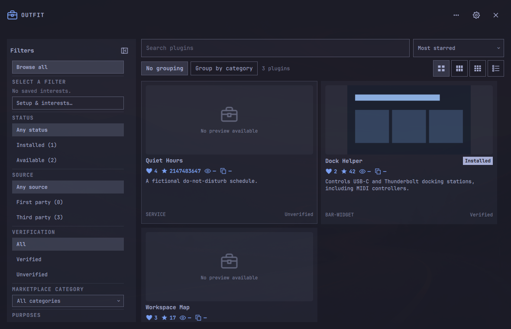
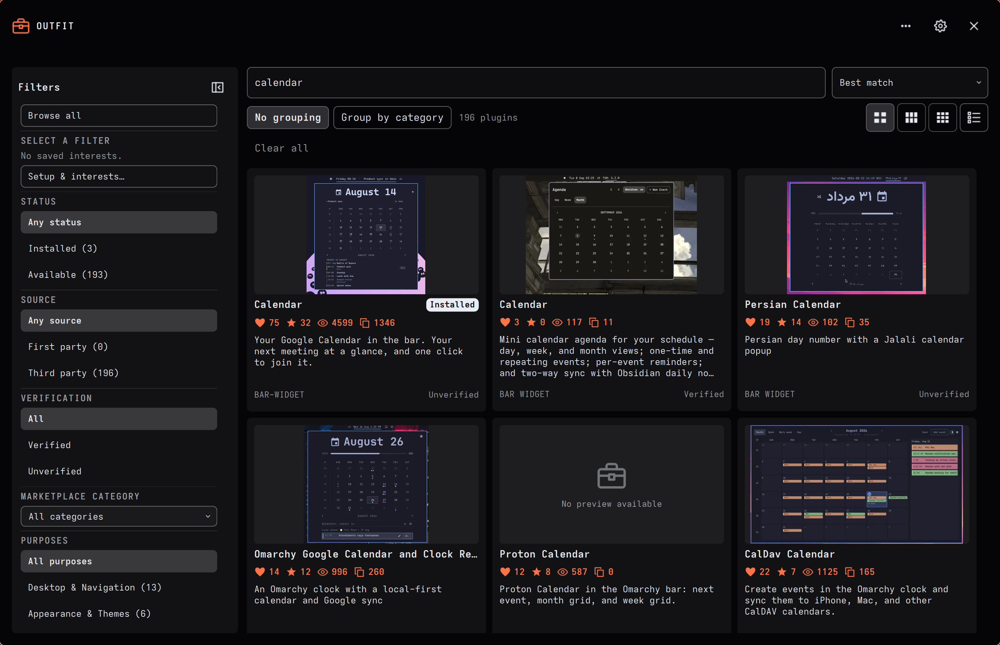
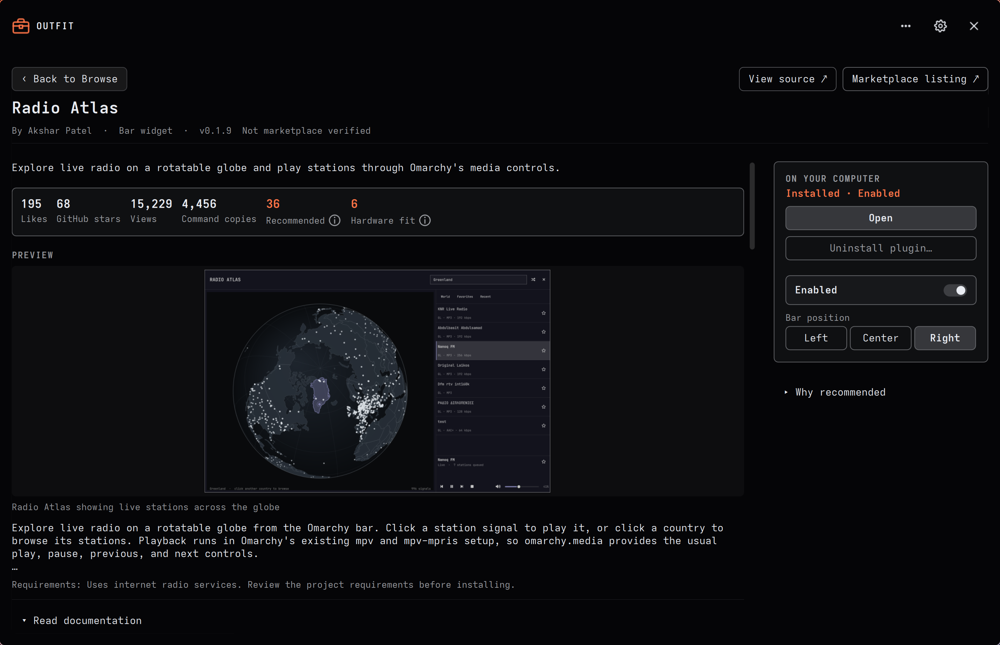

# Outfit

**Find plugins for your Omarchy desktop.**

Outfit brings the Omarchy plugin catalog and your installed plugins into one
place. Browse ideas for your desktop, see why a plugin might suit your setup,
read its documentation, and choose what to install.



*Captured from the running app with real marketplace data. Listings, counts, and
installed status reflect the capture session.*

## What you can do

- **Browse right away.** A bundled catalog snapshot makes listings available on
  first open, while fresh listings and documentation arrive in the background.
- **Rest when closed.** Optional background work pauses when you close Outfit.
  After 30 seconds, its query helper and heavy view data are released; an install
  or update you started still finishes and verifies its result.
- **Find more than a name.** Search listing descriptions, tags, and locally indexed
  READMEs, with excerpts showing where a match came from.
- **Explore ideas for your setup.** Recognized signals from a Framework laptop,
  headphones, displays, or pen input can help surface relevant plugins.
- **Add your interests.** Pick several apps, services, and features at once, or
  add your own topics, then save them together.
- **Batch install plugins.** Add plugins to a batch as you browse, review your
  selections together, then confirm the batch installation and track its progress.
- **Keep plugins up to date.** Compare installed and available versions in the
  details page, or open **Updates** to review and update them together. Outfit's
  own update has a separate **Update Outfit & reopen** action.
- **Manage your plugins.** Install individual plugins, turn supported plugins on
  or off, place bar widgets, and remove third-party plugins.

Hardware-informed suggestions are starting points, not compatibility guarantees.
Each plugin's detail page explains the match and links to its source and setup notes.

<details>
<summary>More screenshots: search and plugin details</summary>

### Search the catalog

Searching for **calendar**, sorted by **Best match**:



### Inspect a plugin

Radio Atlas with its marketplace preview, popularity metrics, and installed-plugin controls:



These are real app captures, taken on September 19, 2026 (UTC).

</details>

## Install

You need **Omarchy 4.0.4 with Quattro** and Python 3.12 or newer. A normal stock
installation is sufficient. Internet access is needed for updates and downloads;
video playback support is optional.

Outfit **0.3.2** is an early testing release. The bundled catalog lets you start
browsing while the searchable documentation library downloads in the background.

Marketplace installs through Outfit use the catalog's exact reviewed commit.
If that commit cannot be fetched and verified, installation stops without falling
back to the repository's latest code.

```bash
omarchy plugin add https://github.com/ctl0v0/outfit.git --enable
```

Open Outfit from its toolbox bar widget. If it is not already on your bar, select
**Outfit** under **Other** in Omarchy's bar settings.

**Upgrading from an early test build?** Follow the
[one-time migration guide](IDENTITY_MIGRATION.md) before using normal updates.

### Optional: add Outfit to Apps

After installing the new build, run:

```bash
python3 -I -B "$HOME/.config/omarchy/plugins/io.github.ctl0v0.outfit/scripts/launcher.py"
```

This adds the toolbox icon to Omarchy's **Apps** list and app search. You can run
it again if needed; it opens the same Outfit window as the bar widget.

## Your first few minutes

1. **Browse or search.** Listings appear from the bundled snapshot immediately;
   browsing does not wait for a full hardware check. Installed plugins are checked
   first so management controls can become ready independently.
2. **Make it yours.** Open **Setup & interests** to review detected inputs and
   choose several interests under **Added by you**. Save once when you're ready.
3. **Read the details.** Select a plugin for its preview, documentation, source,
   requirements, and explanation of why it was suggested.
4. **Choose what to install.** Use **Install**, or **Add to batch install** and
   review your selections together. Installation always asks for confirmation.

The background status separates catalog updates, installed-plugin checks,
optional system-fit checks, and documentation preparation. Documentation first
downloads a public search pack, then imports it locally; remaining eligible
READMEs are added progressively while Outfit is open.

The pack includes README text with licenses that allow redistribution.
Search works locally as coverage grows. Separately, enabled previews can fetch
README screenshot metadata and images for displayed listings when marketplace
previews are missing or unavailable.
The local search index is typically about **30 MB**; see
[coverage and size notes](docs/TECHNICAL.md#search-library-and-current-measurements).

Stock Omarchy may briefly close Outfit when plugin changes reload shell surfaces.
It normally reopens after a few seconds; you can also reopen it from the widget or
Apps. Host-side continuity improvements are being prepared separately for upstream
review, with no promised release or date.

## Privacy, in plain language

Outfit needs no account, sends no telemetry, and does not upload your raw hardware profile.
It requests public catalog metadata, documentation/search packs, and enabled preview images over the network; the hosts can see which resources are requested, and documentation choices can indirectly suggest your interests or hardware.
The raw profile stays in memory for the shell session, while derived preferences, saved interests, cached documents, and bounded batch-resume state can persist locally.

[Privacy and storage details](docs/TECHNICAL.md#privacy-and-network-requests)
explain the requests and controls. README enrichment and thumbnails have separate
settings; pausing documentation updates keeps already cached text searchable.

## Update

In Outfit, open **⋯ More actions → Update Outfit…** to check versions and use
**Update Outfit & reopen**. In-app plugin updates and self-update fetch and verify
the full commit SHA you confirmed before native code replacement. Upstream
movement cannot substitute a newer commit during the native fetch.

For an installation already using the new identity,
you can also update from the terminal:

```bash
omarchy plugin update io.github.ctl0v0.outfit
```

## Remove

Remove the optional launcher first, while its helper is still installed:

```bash
python3 -I -B "$HOME/.config/omarchy/plugins/io.github.ctl0v0.outfit/scripts/launcher.py" --remove
omarchy plugin remove io.github.ctl0v0.outfit
```

Your settings and caches are retained. The [FAQ](docs/USER_GUIDE.md#faq) explains
how to erase them if you want a fresh start.

## Help and further reading

- [User guide and FAQ](docs/USER_GUIDE.md): search, interests, plugin management,
  background activity, and everyday controls.
- [Support](SUPPORT.md): troubleshooting and a small diagnostic report for issues.
- [Technical guide](docs/TECHNICAL.md): matching, privacy, storage, limits, and development.
- [Changelog](CHANGELOG.md): what's new in each build.
- [Security](SECURITY.md): reporting a vulnerability. Omarchy plugins run as
  unsandboxed code inside the shell; review a plugin's source before enabling it.

## License

[MIT](LICENSE), Copyright 2026 ctl0v0. Search-pack documentation retains its own
source licenses and notices; see the [pack policy](docs/SEARCH_PACK.md).
